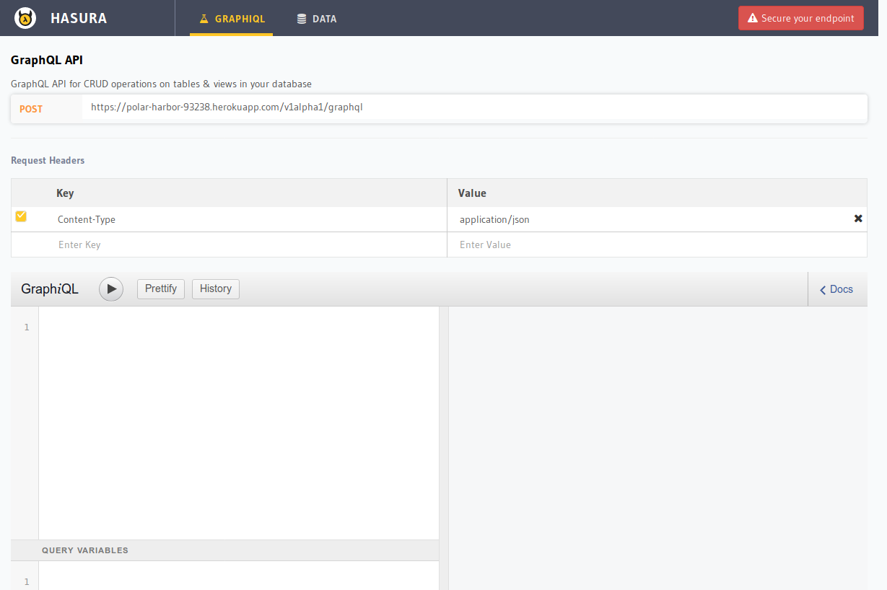

# Hasura GraphQL Engine on Heroku

Hasura GraphQL Engine gives you blazing fast instant GraphQL APIs on Postgres.

## Deploy 

To deploy Hasura on Heroku with Heroku Postgres addon, click the button below:

[](https://heroku.com/deploy?template=https://github.com/hasura/graphql-engine-heroku)

On the Heroku Create New App page that opens, optionally give a name and then choose a region, and then click the "Deploy app" button. Heroku Postgres addon is automatically provisioned and configured with GraphQL Engine.


## Console

Once the app is successfully deployed, you can click the "View" button to see the Console for Hasura GraphQL Engine, where you can create tables, browse data and try out GraphQL queries etc.



## Secure your endpoint

By default, the GraphQL endpoints and the console interface has open permissions and is accessible to everyone. You can secure this by adding an `HASURA_GRAPHQL_ACCESS_KEY` environment variable.

Under "Manage your app", click on "Settings" tab and add a config var with your desired access key.

## Migrations

Hasura can also take care of your database migrations. Install Hasura CLI and configure it to contact the Heroku endpoint.

- Mac/Linux:
  ```bash
  curl -L https://cli.hasura.io/install.sh | bash
  ```
- Windows: [installer](https://cli.hasura.io/install/windows-amd64)

## Read more

For more details, checkout [docs](https://docs.hasura.io/1.0/graphql/manual/getting-started/index.html).
